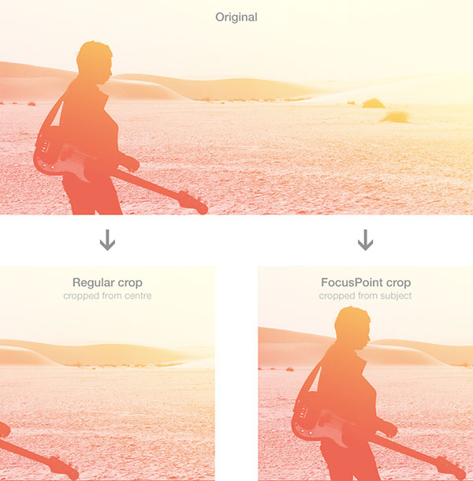

# FocusPoint: Smarter Image Cropping for SilverStripe

The goal of this module is to introduce some basic art direction to control how images are cropped in SilverStripe.

**Problem:** SilverStripe crops all images from the centre. If the subject is off-centre, it may be cropped out.

**Solution:** FocusPoint allows you to tag the subject in an image and ensures it is not lost during cropping.

## Requirements

SilverStripe 3.3+ (SS 3.1+ support available in earlier releases)

## Documentation

* [Installation](docs/en/installation.md)
* [Basic Usage](docs/en/basic-usage.md)
* [Advanced Usage](docs/en/advanced-usage.md)
* [Troubleshooting](docs/en/troubleshooting.md)
* [License](license.md)
* [Contributing](contributing.md)

## To Do

 * Internationalisation
 * Advanced cropping options and interfaces (may be an additional module)
 * Auto detect focus point via Imagga API

## Maintainer contact

[jonathonmenz.com](http://jonathonmenz.com)

## Tip jar

If this module helped you out and you want to say thanks, you're welcome to make a small donation or shout me a steam game.

